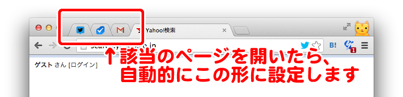

# auto-pin-tab

特定のURLを開いた時に、自動的にタブを固定するChrome拡張です。
いつも開きっぱなしにしているサイトを間違って閉じてしまわないよう、自動で気を使ってくれます。

## Feature

* 該当のタブを"固定"します。タブが左端に寄って表示が小さくなります
* 固定したタブを閉じようとしたり、別のページに遷移しようとした時にアラートを表示します

## Pin target

デフォルトでは、下記のURLを開いた時に自動的に固定します。

* facebook [https://www.facebook.com/](https://www.facebook.com/)
* gmail [https://mail.google.com/mail](https://mail.google.com/mail)
* tweetdeck [https://web.tweetdeck.com/](https://web.tweetdeck.com/)
* chatwork [https://www.chatwork.com/](https://www.chatwork.com/)

他にもオプションから変更ができます。

## Screenshot



## Special Thanks

拡張機能のアイコンは[フリー写真素材のPhoto Chips](http://photo-chips.com/)様の素材を使わせて頂きました。多謝！

[](http://photo-chips.com/)

## Develop

```bash
gem install compass
npm install
grunt build
```